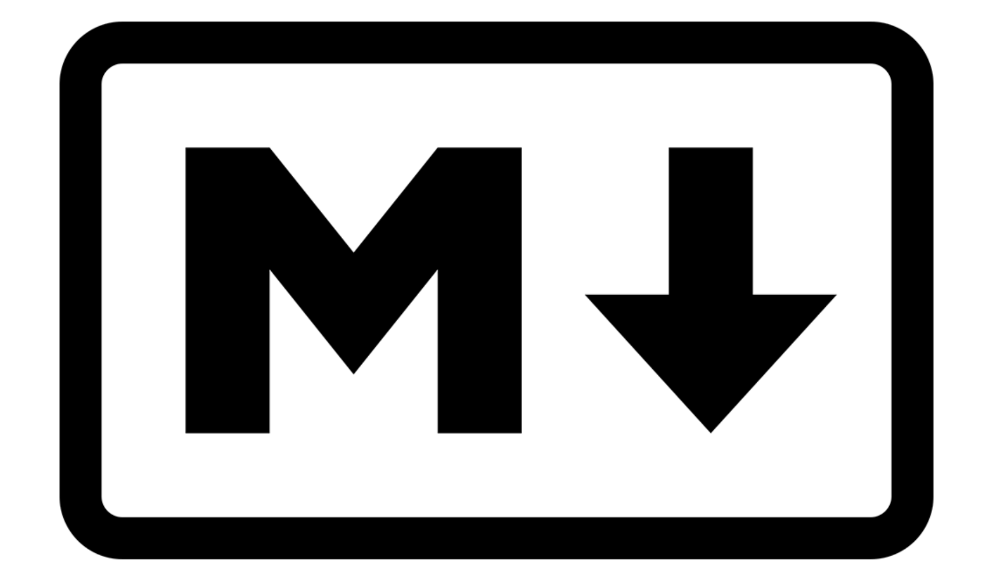

# [Lenguaje de Marcas: Markdown](README.md)

---

- **Markdown** es un lenguaje de marcado creado en 2004 por **John Gruber**.  
- Permite aplicar **formato a texto plano** de manera sencilla y convertirlo fácilmente a **HTML**.  
- Su objetivo principal es mantener un **texto legible** al mismo tiempo que estructurado.  
- Se utiliza mucho en documentación técnica y archivos **README** en repositorios.  

---

### Editores comunes de Markdown
- **MarkdownPad** (Windows) – Vista previa en tiempo real, exportación a HTML/PDF.  
- **UberWriter** (Linux) – Minimalista, soporte de MathJax, exportación múltiple.  
- **Visual Studio Code** (Multiplataforma) – Editor de código con extensiones, vista previa, integración con Git.  
- **Typora** (Multiplataforma) – Vista unificada, soporte de tablas, diagramas y MathJax.  
- **Dillinger** (Online) – Editor sencillo con sincronización con Dropbox/Google Drive/GitHub.  
- **StackEdit.io** (Online) – Editor avanzado con colaboración y soporte MathJax.  

> El editor más recomendado es **Visual Studio Code** por su integración con Git y su facilidad de uso.
